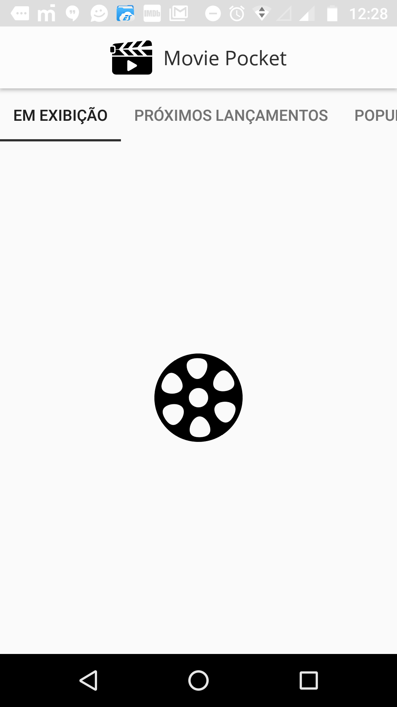
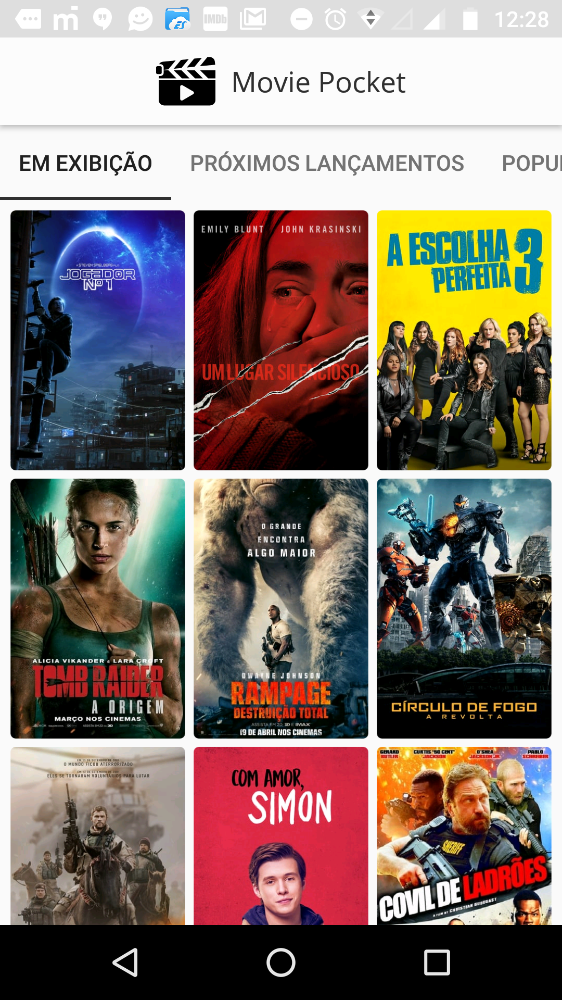
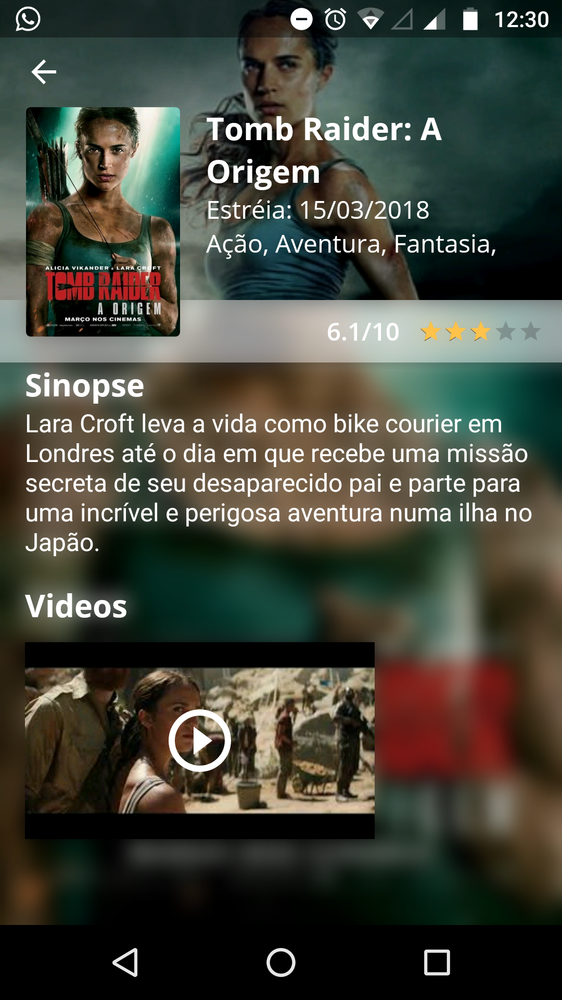

<h1>Movie Pocket</h1>

  
  
  

This is a poc created to showcase a few Android tools. It uses:

-Kotlin

-MVVM

-Android Archtecture with LiveData and ViewModels

-DB lib ObjectBox http://objectbox.io/

-RX

